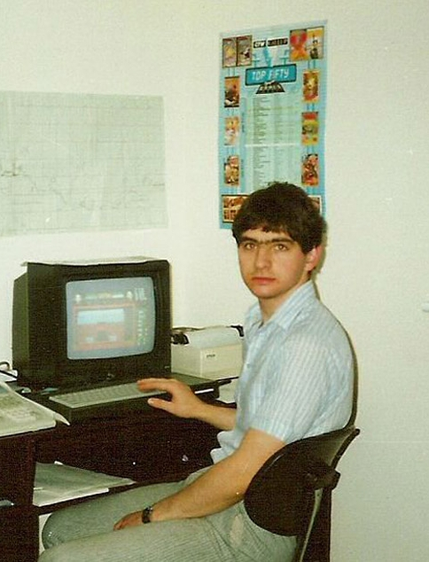
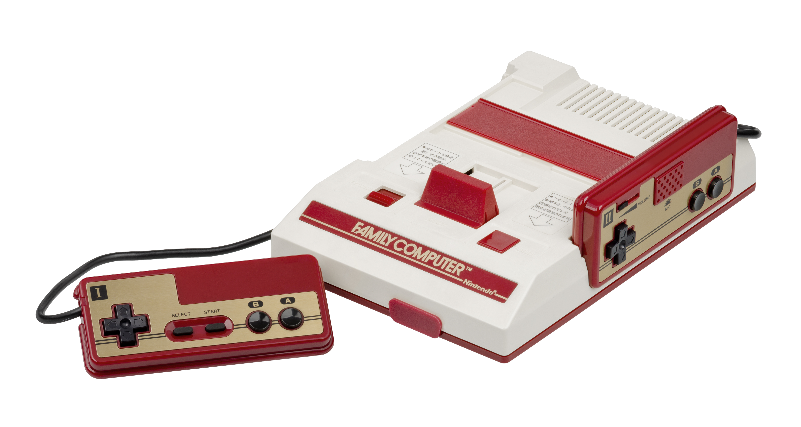

<!-- $theme: default -->

🧙‍

Fantasy Game Consoles

------------------------------------------------------------------------------

🧙‍

Fantasy Game Consoles

or

Party Like It's 1984

------------------------------------------------------------------------------
# What the hell is a "fantasy console"?

### Imagine an "emulator"... but for a mythical old-school video game console that _never actually existed!_

------------------------------------------------------------------------------

There is a certain romanticism associated with the 1980s "bedroom programmer".

Hardware was limited in resources. Game development didn't require teams of developers and artists.

------------------------------------------------------------------------------

<small>While the NES was a step above the Apple ][ or Atari 8-bit home computers of the era, it's closer to the typical "fantasy console" specs:</small>

||1983|201x
:---:|:----:|:----:
**CPU**|1.79 Mhz 8-bit 6502|4 Ghz 64-bit OcTo-CoReZ 🐙
**RAM**|2Kb|8Gb
**STORAGE**|8k battery backed SRAM|Terabytes...
**VIDEO**|256x240 tile-based graphics with hardware sprites|1920x1080 (or much more) GPU accelerated 2D/3D
**COLORS**| 4 per 8x8 tile/sprite, from a palette of 52 hard-coded colors| *All of them.*

------------------------------------------------------------------------------

# Circling back to "fantasy consoles"...

* Coders are wusses in 2019! We've grown **soft**. Many of us don't want to code down to the metal anymore. We love our JavaScript. Or our Python.  Or what have you.
* Or, you know, we just want all the fun of dabbling in that simpler world without getting our hands too dirty.

------------------------------------------------------------------------------
Fantasy consoles are essentially _virtual machines_ that introduce arbitrary limitations: 

* The **graphics capability** - typically 128x128 or around there, with a limited pre-defined color palette (maybe 16 colors, if you're lucky). You usually get hardware sprites and tile mapped graphics. Maybe direct access to graphics RAM.
* The **input** - you usualy get locked down to one or two gamepads with U/D/L/R and maybe two action buttons.
* Simple **music and sound effects** 
* And most notably, you don't program them on a machine lanuage level. They usually incorporate a higher-level language, such as Lua or BASIC. **[FIXME?]**

------------------------------------------------------------------------------

# Pico-8
There are **several** fantasy consoles out there, but one of the most popular is is [Pico-8](https://www.lexaloffle.com/pico-8.php). <small>(We'll look at this and then quickly check out the others.)</small>

### Out of the box, Pico-8 provides:
* A Lua **code** editor...
* A sprite and tile **pixel art editor**...
* A **tile map editor**...
* A **sound effects creator**...
* A **music tracker**...

..._all in one executable_.
